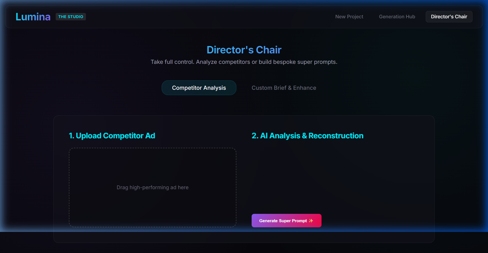
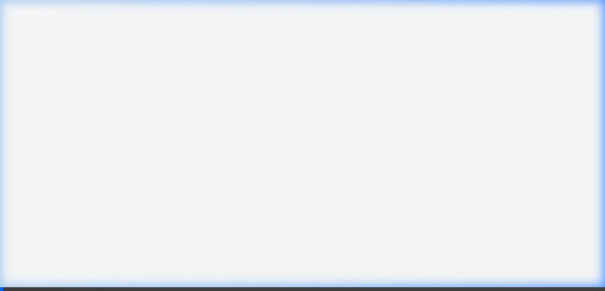

# Lumina: AI-Assisted Creative Studio



Lumina is a next-generation marketing and creative studio interface built with React. It provides an immersive "God Mode" experience for art directors and marketers to upload products, seamlessly generate hyper-realistic campaign assets, orchestrate storyboards, and synthesize dynamic video/audio clips—all powered by simulated AI layers natively within the browser.

## ✨ Features

- **The Generation Hub:** Upload product imagery and generate an array of visual concepts spanning various aesthetics (Influencer, Cinematic, Midnight Luxury).
- **Director's Chair Analysis:** Upload competitor ads for instant "AI analysis" to determine compositional strengths, and use those insights to auto-generate powerful new creative prompts.
- **Neural Storyboard:** Build dynamic commercials directly in the browser by dragging and dropping visual assets.
- **Functional Video & Audio Rendering:**
  - **Text-to-Speech:** Uses the native browser Web Speech API to synthesize voiceover scripts on the fly using real operating system voices.
  - **Motion Synthesis:** Uses advanced CSS keyframe animation techniques (Ken Burns pan & zoom) alongside modal overlays to simulate rapid video generation from static imagery.
- **Bespoke Vision Generation:** Simulated deeply customized generative flows for client-specific concepts.
- **Performance Prediction Engine:** Toggleable heatmap overlays on generated assets simulating AI attention-prediction to gauge viewer focus.
- **AI Co-Director Assistant:** A context-aware floating AI agent that provides strategic insights based on the current active tab (e.g., uploading vs. storyboarding).

### God Mode Demo Walkthrough



## 🚀 Tech Stack

- **Frontend Framework:** React 18, Vite
- **Styling:** Custom CSS, CSS Variables for seamless theming (Dark Mode, Neon Accents, Glassmorphism).
- **APIs Used:** Web Speech API (`window.speechSynthesis`) for functional Text-to-Speech voiceovers.

## 🛠️ Getting Started

First, clone the repository and install the dependencies.

```bash
git clone https://github.com/bhakthan/Lumina.git
cd Lumina
npm install
```

Start the Vite development server:

```bash
npm run dev
```

The application will be running locally, typically on `http://localhost:5173`.

## 🎨 Design Philosophy

Lumina emphasizes a **premium, futuristic, "glassmorphic" interface**. The design purposefully sidesteps standard UI frameworks (like Tailwind or Bootstrap) in favor of meticulously handcrafted CSS. The goal is to provide a highly stylized, engaging environment featuring glowing accents, deep dark modes, and subtle micro-animations that make the application feel "alive."

## 📝 License

This project is licensed under the MIT License - see the [LICENSE](LICENSE) file for details.
